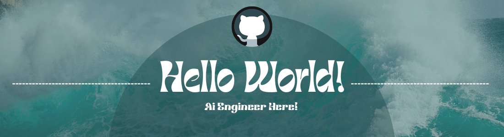

<h2>👻I'm Michelle</h2>

I am a University student learning Artifical intelligence.
 
 
I have a massive love for programming and i am highly dedication to expand my skillset through projects.

<h2>🌱What Im Currently Learning...</h2>
<ul>
<li>AI bots to do a vaired amount of different tasks</li>
<li>Making interfaces</li>
</ul>

<h2>📫Where To Find Me...</h2>

<a href = "https://www.linkedin.com/in/michelle-elizabeth-thomson/">My LinkedIn!</a>

<!--
**ChellT/ChellT** is a ✨ _special_ ✨ repository because its `README.md` (this file) appears on your GitHub profile.

Here are some ideas to get you started:

- 🔭 I’m currently working on ...
- 🌱 I’m currently learning ...
- 👯 I’m looking to collaborate on ...
- 🤔 I’m looking for help with ...
- 💬 Ask me about ...
- 📫 How to reach me: ...
- 😄 Pronouns: ...
- ⚡ Fun fact: ...
-->
